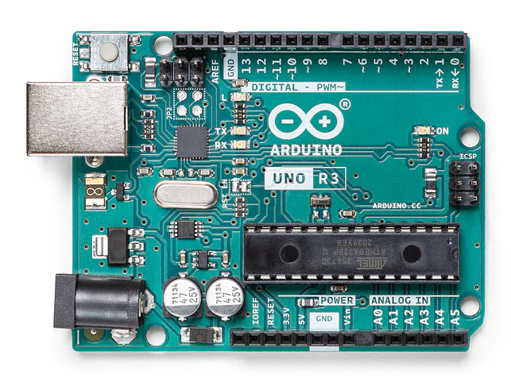
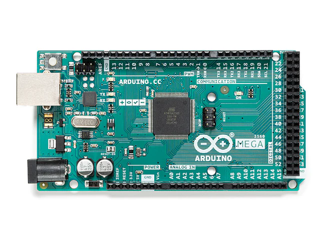
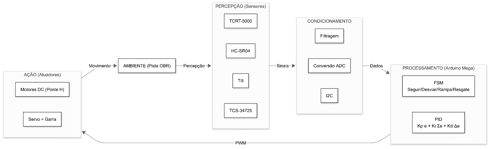

# Tinkerer: construção de robô autônomo e mapeamento do conhecimento em robótica

**Instituição:** IFRN — Campus Santa Cruz
**Autores:** Antonny Adryan de Andrade; Cícero Bento Dantas Fernandes; Gervásio Filho Souza de Lima; Jácio Mauê do Nascimento Silva
**Local e data:** Santa Cruz/RN, agosto de 2026

> Documento convertido e organizado a partir do [DOCX original](Projeto-de-Pesquisa-Tinkerer-Original.docx). O conteúdo técnico foi mantido; as figuras extraídas estão em [figuras/](figuras/), e as equações estão escritas em LaTeX.

## Navegação

- [Dados do projeto](#dados-do-projeto)
- [Discriminação do projeto](#discriminacao-do-projeto)
- [Resumo](#resumo)
- [Introdução](#introducao)
- [Justificativa](#justificativa)
- [Fundamentação teórica](#fundamentacao-teorica)
- [Objetivos](#objetivo-geral)
- [Metodologia](#metodologia-da-execucao-do-projeto)
- [Biossegurança e gestão ambiental](#procedimentos-de-biosseguranca-e-gestao-ambiental-de-residuos)
- [Acompanhamento e avaliação](#acompanhamento-e-avaliacao-do-projeto-durante-a-execucao)
- [Resultados esperados](#resultados-esperados)
- [Referências](#referencias-bibliograficas)

---

## DADOS DO PROJETO

| Campo / Item | Informação / Valor |
| --- | --- |
| Início da Execução | 17/08/2026 (01/06/2026 - Registro Retroativo) |
| Término da Execução | 01/12/2026 |
| Área Temática | Tecnologia e Produção |
| Tema | Desenvolvimento tecnológico: desenvolvimento de programas, sistemas ou produtos de cunho informacional ou industrial. |
| Área do Conhecimento | CIÊNCIA DA COMPUTAÇÃO (CIÊNCIAS EXATAS E DA TERRA) |
| Grupo de Pesquisa | Núcleo de Pesquisa em Automação e Tecnologia da Informação do Trairi |
| Tem interesse no fomento para custeio | Sim |
| Classificação TRL | TRL 4 |
| Comitê de Ética em Pesquisa (CEP) | Não necessário para o uso deste projeto por conta que em nossa instituição indicado pelo coordenador de pesquisa |
| Carga Horária do Orientador | 4 horas semanais |
| Carga Horária dos Discentes | 20 horas semanais (por aluno) |
| Objetivos da ONU para o Desenvolvimento Sustentável | 4, 9, 10 |
| Subobjetivos da ONU para o Desenvolvimento Sustentável | 4.4, 4.a, 9.5, 10.2 |
| Prevê atividades de internacionalização, inclusive participação em eventos internacionais: | Não |

## DISCRIMINAÇÃO DO PROJETO

### RESUMO

A robótica educacional apresenta potencial como ferramenta estratégica para o desenvolvimento de competências STEM, e a Olimpíada Brasileira de Robótica (OBR) desafia equipes a construir robôs autônomos para cenários de resgate. No IFRN Campus Santa Cruz, equipes iniciantes enfrentam barreiras como ausência de documentação técnica padronizada e desconhecimento prévio, gerando retrabalho e descontinuidade. Este projeto visa desenvolver um robô autônomo funcional de baixo custo baseado em Arduino MEGA 2560 para as modalidades prática (N2), virtual (N2) e teórica (N5) da OBR, articulado à avaliação do conhecimento discente sobre robótica. A metodologia ágil, inspirada no Scrum, divide-se em sprints quinzenais que abrangem prototipagem, programação em C++/C# e testes. Será aplicado questionário estruturado aos discentes, conforme o Edital nº 01/2026. Espera‑se um protótipo com tempo de percurso inferior a 4 minutos em 70% das tentativas, robô virtual com taxa de sucesso ≥ 80% e um guia técnico aberto no GitHub com custo < R$ 800,00. Espera-se que a sistematização do conhecimento produzido contribua para a continuidade das atividades de robótica no campus.

### PALAVRAS-CHAVE

Robô autônomo. Olimpíada Brasileira de Robótica. Arduino. Controle PID. Mapeamento Educacional.

### INTRODUÇÃO

A Robótica Educacional apresenta potencial como recurso para o desenvolvimento de competências em Ciência, Tecnologia, Engenharia e Matemática (STEM), podendo favorecer o raciocínio lógico, a resolução de problemas e outras habilidades relacionadas à aprendizagem (BENITTI, 2012; MACHADO; CÂMARA; WILLIANS, 2018). Nesse cenário, a Olimpíada Brasileira de Robótica (OBR) destaca-se como a principal competição nacional da área, desafiando estudantes a projetar e programar robôs autônomos capazes de navegar por cenários simulados de resgate de vítimas, nas modalidades prática, virtual e teórica (OBR, 2026a; OBR, 2026b). No âmbito do Instituto Federal do Rio Grande do Norte (IFRN) – Campus Santa Cruz, o projeto considera como problema a ser investigado o desconhecimento prévio sobre robótica e a possível dificuldade de acesso a documentação técnica organizada e publicamente disponível, fatores que podem contribuir para retrabalho e descontinuidade no desenvolvimento das atividades. Além disso, estudos com estudantes do ensino básico indicam que a experiência prévia em robótica está associada a diferenças no desejo de aprendizagem e na confiança para aprender robótica (KUCUK; SISMAN, 2020). Diante do exposto, este projeto busca responder à seguinte questão: é viável técnica e materialmente construir um robô autônomo de baixo custo, baseado em plataforma Arduino, que atenda aos requisitos das modalidades prática (Nível 2), virtual (Nível 2) e teórica (Nível 5) da Olimpíada Brasileira de Robótica, e sistematizar esse conhecimento em uma base de referência acessível para equipes futuras do IFRN Campus Santa Cruz? Para superar essas barreiras, o presente projeto propõe a estruturação de um ambiente de desenvolvimento colaborativo e versionado em plataforma aberta (GitHub), aliado à construção de um robô autônomo funcional de baixo custo baseado no microcontrolador Arduino MEGA 2560, integrando a simulação no ambiente sBotics e a modelagem mecânica de uma garra adaptada com peças reaproveitadas. De maneira articulada, a proposta engloba uma dimensão social destinada a mapear o nível de conhecimento prévio, as percepções e as demandas do corpo discente do campus em relação à robótica educacional. Com isso, busca-se consolidar um guia técnico de referência aberta capaz de acelerar o aprendizado de equipes futuras e fortalecer a inclusão científica no IFRN Campus Santa Cruz.

### JUSTIFICATIVA

A relevância deste projeto pauta-se na articulação entre a democratização do acesso à tecnologia de baixo custo, a continuidade da produção científica local e o impacto social na formação discente.Sob a perspectiva técnica e econômica, o uso da plataforma Arduino Mega 2560, combinado ao reaproveitamento de peças e componentes eletrônicos, contribui para a redução do custo de produção do robô, estimado em valor inferior a R$ 800,00. Essa abordagem demonstra a possibilidade de desenvolver um protótipo voltado à participação na OBR utilizando componentes de baixo custo e materiais reaproveitados, reduzindo a dependência de kits proprietários de maior custo financeiro. Tal estratégia está em consonância com a literatura que apresenta o Arduino como uma alternativa de baixo custo para experiências educacionais envolvendo aquisição e controle de dados (SOUZA et al., 2011). Complementarmente, a implementação de um repositório centralizado na plataforma GitHub busca preservar e organizar o conhecimento produzido durante o desenvolvimento do projeto, reduzindo a possibilidade de perda de informações entre diferentes turmas e equipes. Para favorecer a continuidade das atividades e reduzir retrabalho, o projeto será acompanhado por documentação técnica aberta, contendo esquemas, código comentado, critérios de calibração e registros de testes. Dessa forma, o versionamento do código em C++, a organização das simulações e a disponibilização das modelagens constituirão uma base de conhecimento que poderá ser consultada e reutilizada por futuras equipes do campus. No âmbito pedagógico e social, o mapeamento diagnóstico junto aos discentes do IFRN Campus Santa Cruz permitirá identificar o perfil, o interesse e as principais barreiras percebidas pelos estudantes em relação à tecnologia e à robótica. A revisão realizada por Benitti (2012) indica que a robótica educacional apresenta potencial para apoiar a aprendizagem e o desenvolvimento de diferentes habilidades, embora ressalte que seus resultados educacionais não são garantidos pela simples utilização da robótica e que ainda existem limitações nas evidências empíricas disponíveis. Nesse contexto, a produção de documentação técnica aberta e sistematizada constitui uma decisão metodológica do próprio projeto, destinada a organizar o conhecimento produzido durante o desenvolvimento do protótipo e facilitar sua consulta e reutilização por equipes futuras. A investigação diagnóstica proposta poderá fornecer informações para orientar estratégias institucionais relacionadas ao ensino de robótica, à participação em competições científicas e tecnológicas e ao incentivo à formação de novos estudantes na área. Dessa maneira, o projeto também se relaciona aos Objetivos de Desenvolvimento Sustentável 4 (Educação de Qualidade), 9 (Indústria, Inovação e Infraestrutura) e 10 (Redução das Desigualdades), especialmente no que diz respeito à ampliação das oportunidades de aprendizagem tecnológica e ao acesso a soluções de baixo custo. Além dos aspectos técnicos e pedagógicos, serão adotados procedimentos de segurança durante a construção e os testes do protótipo, incluindo medidas de proteção contra curtos-circuitos, cuidados no manuseio dos componentes eletrônicos e utilização de equipamentos de proteção individual durante atividades de soldagem. Também serão observados procedimentos para o descarte ambientalmente adequado de pilhas, baterias e resíduos eletrônicos inservíveis, contribuindo para a segurança da equipe e para a responsabilidade socioambiental do projeto.

### FUNDAMENTAÇÃO TEÓRICA

A fundamentação teórica constitui a base conceitual sobre a qual se sustentam as escolhas técnicas deste projeto, reunindo os princípios de eletrônica, programação e robótica necessários para justificar cada decisão de hardware e software adotada no desenvolvimento do protótipo. O domínio desses fundamentos é o que permite ao técnico desenvolvedor não apenas reproduzir soluções prontas, mas compreender o porquê de cada escolha de componente e de algoritmo — habilidade reconhecida pela Base Nacional Comum Curricular como parte do eixo de pensamento computacional na educação básica (MINISTÉRIO DA EDUCAÇÃO, 2022; MIOTO et al., 2019). Conforme evidenciado por Brackmann et al. (2017), o desenvolvimento do Pensamento Computacional não depende exclusivamente do uso de tecnologias digitais; atividades práticas e estruturadas, mesmo sem dispositivos eletrônicos, podem produzir ganhos significativos em raciocínio lógico e resolução de problemas. Essa constatação reforça a importância de iniciativas como a Olimpíada Brasileira de Robótica (OBR), que articulam teoria e prática em um ambiente de aprendizagem ativa, e justifica a opção deste projeto por documentar e sistematizar o conhecimento produzido, de modo a reduzir as barreiras de entrada para equipes futuras.

Neste fundamentação, os conceitos são apresentados de forma integrada: parte-se da definição de robótica e de seus elementos essenciais, avança-se para os fundamentos de eletrônica digital e microcontroladores, detalha-se a plataforma Arduino e seus periféricos e, por fim, contextualiza-se a Olimpíada Brasileira de Robótica (OBR), que orienta os requisitos do projeto.

### ROBÓTICA

A robótica é um ramo da tecnologia que engloba mecânica, eletrônica e computação, tratando de sistemas compostos por máquinas e partes mecânicas automáticas controladas por circuitos integrados. No entanto, para além dessa definição técnica, é fundamental compreender o que caracteriza um robô propriamente dito. Segundo Matarić (2007, p. 20), uma das principais referências mundiais na área, “um robô é um sistema autônomo que existe no mundo físico, pode perceber seu ambiente e pode agir sobre ele para atingir alguns objetivos” (tradução nossa). Essa definição desdobra‑se em cinco componentes essenciais: a autonomia, pois o robô toma decisões por si mesmo sem controle humano contínuo; a existência no mundo físico, o que o sujeita às leis da mecânica, do tempo e da energia; o sensoriamento, por meio de sensores que percebem o ambiente e seu próprio estado; a ação, exercida por atuadores que modificam o meio; e, por fim, a orientação a objetivos, mesmo que simples como “não colidir” ou “resgatar a vítima”. No contexto educacional, a robótica vai além da simples montagem de dispositivos: caracteriza‑se como uma estratégia pedagógica que articula conceitos de física, matemática e programação em torno de um objeto concreto e manipulável, favorecendo a aprendizagem ativa e a resolução de problemas (BENITTI, 2012). O robô projetado neste trabalho atende a todos os cinco critérios de Matarić, pois será autônomo (controlado por firmware embarcado), operará no mundo real (com componentes eletromecânicos), usará sensores (infravermelho, ultrassônico, de cor e inclinação), agirá sobre o ambiente (motores e garra) e terá como objetivo cumprir o percurso da OBR.

#### ROBÓTICA EDUCACIONAL E PENSAMENTO COMPUTACIONAL

No contexto educacional, a robótica vai além da simples montagem de dispositivos: caracteriza‑se como uma estratégia pedagógica que articula conceitos de física, matemática e programação em torno de um objeto concreto e manipulável, favorecendo a aprendizagem ativa e a resolução de problemas (BENITTI, 2012). Estudos recentes indicam que a robótica educacional, quando apoiada por documentação acessível e sistematizada, potencializa o desenvolvimento de competências do século XXI, como pensamento crítico, criatividade e trabalho colaborativo (MACHADO; CÂMARA; WILLIANS, 2018; MORAES et al., 2023). Além disso, Brackmann et al. (2017) demonstraram que atividades desplugadas — isto é, realizadas sem o uso de computadores — são igualmente eficazes para o desenvolvimento do raciocínio lógico e da capacidade de abstração, o que sustenta a abordagem adotada neste projeto, que combina a prototipagem física com a simulação virtual (sBotics) e a produção de material didático acessível, garantindo que o aprendizado em robótica não fique restrito à disponibilidade de hardware de alto custo.

#### ELETRÔNICA

A eletrônica é o ramo da engenharia e da física aplicado ao controle do fluxo de elétrons em condutores e semicondutores, permitindo converter sinais elétricos em informação processável por um sistema. Um circuito eletrônico básico de aquisição de dados, como o empregado em placas de prototipagem, opera justamente nesse princípio: capta uma grandeza física (luz, distância, tensão) e a converte em um sinal interpretável pelo microcontrolador (SOUZA et al., 2011).

##### COMPONENTES FUNDAMENTAIS DA ELETRÔNICA

No ramo da eletrônica, há diversos componentes passivos e ativos que compõem um circuito elétrico. Componentes passivos, como o resistor, o capacitor e o indutor, não amplificam nem geram energia, apenas a armazenam, dissipam ou se opõem à sua passagem; já componentes semicondutores, como o diodo e o transistor, controlam o fluxo de corrente de forma ativa. A seguir, descrevem-se os componentes básicos empregados na montagem dos circuitos deste projeto, com ênfase em suas aplicações práticas no robô ( MONK, 2010).

**Resistor:** O resistor é um componente que limita a passagem de corrente elétrica em determinadas partes do circuito. Sua unidade de medida é o ohm (Ω). No projeto, resistores são utilizados para limitar a corrente nos LEDs indicadores, nos sensores infravermelhos (pull-up/pull-down) e nas bases dos transistores da ponte H, garantindo que os sinais sejam estáveis e que os componentes não sejam danificados por corrente excessiva.

**Capacitor Eletrolítico:** O capacitor armazena e descarrega cargas elétricas. Em circuitos de Corrente Contínua (CC), atua como elemento de armazenamento; em Corrente Alternada (CA), apresenta reatância capacitiva (oposição à passagem de corrente, medida em ohms), que varia com a frequência do sinal. Sua unidade de medida é o farad (F). No robô, capacitores eletrolíticos são posicionados em paralelo com a alimentação dos motores DC para filtrar ruídos de comutação e estabilizar a tensão fornecida ao Arduino, evitando quedas de tensão que possam reiniciar o microcontrolador.

**Indutor:** O indutor armazena energia em um campo magnético e se opõe a variações bruscas de corrente, sendo utilizado em filtros e fontes de alimentação. Sua unidade de medida é o henry (H). Embora não seja um componente central neste projeto, o indutor é mencionado por sua presença em circuitos de potência e na compreensão do funcionamento de motores DC, que possuem indutância inerente em seus enrolamentos.

**Diodo:** O diodo permite a passagem de corrente elétrica em apenas um sentido, bloqueando a corrente contrária à sua polaridade. É comumente utilizado em circuitos retificadores e como proteção contra picos de tensão. No projeto, diodos do tipo 1N4007 são conectados em antiparalelo com cada motor DC — os chamados diodos de roda livre (flyback diodes) — com o objetivo de proteger a ponte H e o microcontrolador contra os picos de tensão (tensão contra-eletromotriz) gerados quando a corrente é interrompida, evitando danos aos componentes semicondutores.

##### ELETRÔNICA DIGITAL

A vertente digital da eletrônica, em particular, representa e processa informação por meio de níveis discretos de tensão – tipicamente dois, associados aos estados lógicos 0 e 1 – em contraposição à eletrônica analógica, que trabalha com variações contínuas de sinal. Conforme Nogueira (2011, p. 9), todo sistema numérico é constituído por um conjunto ordenado de símbolos (dígitos) com regras definidas para operações matemáticas, sendo o número de símbolos denominado base ou raiz. .

###### SISTEMA DE NUMERAÇÃO BINÁRIO

O sistema binário, de base 2, utiliza apenas os dígitos 0 e 1 – cada um denominado bit (contração de binary digit) – e é a base de funcionamento de todo circuito digital, incluindo os microcontroladores empregados em robótica. A representação polinomial de um número binário, que expressa o valor de cada dígito como potência de 2, permite converter entre bases (decimal, octal, hexadecimal) e é amplamente utilizada na programação de microcontroladores, onde constantes e endereços de memória são frequentemente escritos em notação hexadecimal para maior compactação (NOGUEIRA, 2011, p. 10-19). No contexto do Arduino, essa lógica binária aparece diretamente na leitura e escrita de sinais digitais (HIGH = 1, LOW = 0), sendo também possível empregar conversões para outras bases na codificação de caracteres e na definição de máscaras de bits para controle de periféricos.

###### ÁLGEBRA BOOLEANA

Ainda segundo Nogueira (2011, p. 27-29), a álgebra booleana, fundamentada no sistema binário, estabelece as leis e operações formais que regem os circuitos lógicos. Seus operadores fundamentais – NOT (inversão), AND (conjunção) e OR (disjunção) –, bem como os derivados NAND, NOR, XOR e XNOR, são a base para a implementação de todas as funções de decisão e controle em sistemas digitais. Em um robô autônomo, essas operações lógicas são utilizadas, por exemplo, para combinar leituras de sensores (se o sensor infravermelho detecta linha E o ultrassônico não detecta obstáculo, então siga em frente), implementar máquinas de estados para controle de fluxo e construir circuitos de temporização e decodificação de sinais. O conhecimento desses operadores e de suas propriedades (como os teoremas de De Morgan e as leis de absorção e adjacência) é indispensável para a compreensão do funcionamento interno do microcontrolador e para a otimização do código embarcado, que deve responder em tempo real às condições da pista (NOGUEIRA, 2011, p. 34-46). Ademais, a minimização de funções lógicas por meio de mapas de Karnaugh – técnica apresentada por Nogueira (2011, cap. 3) – embora não seja aplicada diretamente na programação em alto nível, ilustra o princípio de simplificação de decisões que pode ser transportado para o projeto de algoritmos eficientes no Arduino.

#### MICROCONTROLADORES

Os microcontroladores são circuitos integrados que reúnem, em um único chip, processador, memória e periféricos de entrada e saída, sendo projetados para executar uma função específica de forma autônoma após programados e alimentados eletricamente. Diferem dos microprocessadores de uso geral justamente por essa integração: enquanto um computador convencional depende de componentes externos de memória e armazenamento, o microcontrolador já os incorpora internamente, o que reduz custo, consumo de energia e espaço físico – características decisivas para sua adoção em sistemas embarcados de robótica (PRADO et al., 2025). Entre os tipos de memória presentes nesses dispositivos, destacam‑se: a **RAM** (volátil, para leitura e escrita de dados durante a execução do programa), a **Flash** (não volátil, onde o firmware é armazenado permanentemente), a **ROM** (não volátil, apenas leitura, contendo o bootloader) e a **EEPROM** (programável e apagável eletricamente, que mantém os dados mesmo sem energia, porém com acesso mais lento e capacidade limitada, ideal para armazenar parâmetros de calibração). No Arduino Mega 2560 utilizado neste projeto, a memória Flash de 256 KB armazena o código do firmware, a SRAM de 8 KB é usada para variáveis durante a execução, e a EEPROM de 4 KB pode ser empregada para guardar os ganhos calibrados do controle PID, permitindo que o robô mantenha suas configurações mesmo após ser desligado.

#### ARDUINO

O Arduino é uma plataforma de prototipagem eletrônica de hardware livre, amplamente adotada em projetos práticos de automação e robótica por sua simplicidade de uso e baixo custo de aquisição (SOUZA et al., 2011). Ele é constituído por entradas e saídas (inputs e outputs) e contém um chip microcontrolador, sendo programado em C++ por meio de uma IDE (Integrated Development Environment) que oferece um ambiente simplificado para compilação e upload de código. Por permitir associar a leitura de sensores a comandos diretos sobre atuadores em poucas linhas de código, o Arduino reduz a barreira de entrada à robótica embarcada, sendo descrito na literatura como uma alternativa de baixo custo a equipamentos comerciais de aquisição de dados, sem perda relevante de precisão para aplicações educacionais (SOUZA et al., 2011; Cavalcante; Tavolaro, 2011) . Existem diversos tipos de placas de Arduino. Dentre elas:

A Figura 1 apresenta o Arduino Uno R3, que é um dos modelos mais básicos e amplamente utilizados, contando com um número adequado de portas digitais e analógicas para projetos de menor porte

**Figura 1 – Foto de um Arduino UNO R3**

Fonte: [Arduino](https://store-usa.arduino.cc/products/arduino-uno-rev3?srsltid=AfmBOopFPy95SpO1rZaqFqvRWMR6Qjeep-6d0k5FWUTInQki4cG_k6Vb), \[s.d.\]

Por sua vez, a Figura 2 apresenta o Arduino MEGA 2560, modelo selecionado para este projeto por disponibilizar uma quantidade superior de portas (54 digitais e 16 analógicas) e capacidade de armazenamento significativamente maior, tornando-o ideal para sistemas que demandam o controle simultâneo de múltiplos sensores e atuadores.

**Figura 2 – Foto de um Arduino MEGA 2560**

Fonte: Arduino, \[s.d.\]

##### Fontes de Energia

A alimentação pode ser feita via cabo USB (que também permite a comunicação com o computador) ou pela entrada VIN, que aceita fontes externas como pilhas e baterias com tensão de até 12 V, acima da qual a placa pode ser danificada.

##### Alimentação e filtragem

Para evitar reinicializações do microcontrolador causadas por picos de corrente dos motores, planejamos testar inicialmente o robô com uma única bateria de 7,4 V (LiPo) alimentando todo o sistema (Arduino, motores e servo). Caso ocorram reinicializações ou instabilidade, adotaremos a solução de alimentação separada: uma bateria de 7,4 V exclusiva para os motores e servo, e outra de 9 V para o Arduino, com GND comum.

##### Pinos Digitais e Analógicos

Os pinos digitais operam com dois níveis lógicos (HIGH = 1, LOW = 0) e podem ser configurados como entrada ou saída, enquanto os pinos analógicos convertem sinais contínuos em valores discretos de 0 a 1023, sendo utilizados para leitura de sensores que variam sua resistência ou tensão, como os de luminosidade e temperatura.

##### Sensores e Atuadores

Sensores e atuadores formam o ciclo de percepção e ação característico de um sistema embarcado: o sensor converte uma grandeza física do ambiente em sinal elétrico interpretável pelo microcontrolador, e o atuador converte a decisão do firmware em uma ação física sobre o ambiente, fechando a malha de controle entre robô e mundo real (PRADO et al., 2025).

##### Sensor Infravermelho

Para a detecção de linha, este projeto utiliza o sensor infravermelho TCRT‑5000, que possui um emissor e um receptor de luz infravermelha; sua saída pode ser digital (0 ou 1, indicando presença ou ausência de reflexão) ou analógica (0 a 1023), o que permite maior sensibilidade para ajustes finos de calibração.

##### Sensor de Inclinação

O sensor de inclinação detecta desníveis por meio de uma esfera metálica que, ao se deslocar, fecha ou abre um contato elétrico, fornecendo sinal digital (1 para inclinado, 0 para plano) e sendo empregado na identificação de rampas. Por se tratar de um contato mecânico, o sinal do sensor Tilt está sujeito a oscilações indesejadas (efeito bounce). Para mitigar leituras falsas, o firmware implementará uma rotina de temporização (utilizando a função millis() ou um contador) que ignora transições de estado com duração inferior a 50 ms, técnica conhecida como debounce por software (MONK, 2010). Essa abordagem garante que a detecção da rampa seja confiável, evitando que vibrações mecânicas durante o deslocamento do robô gerem falsos acionamentos.

##### Sensor de Cores

O sensor de cores TCS‑34725, baseado em fotodiodos sensíveis aos componentes RGB (vermelho, verde, azul), identifica cores com auxílio de um LED de iluminação e de um filtro infravermelho, sendo usado para distinguir vítimas ou zonas específicas na pista.

##### Sensor Ultrassônico

O sensor ultrassônico HC‑SR04 emite ondas sonoras em frequência ultrassônica e mede o tempo de retorno do eco, calculando a distância até o objeto (alcance típico de 2 cm a 4 m); é amplamente utilizado em robôs autônomos para desvio de obstáculos, combinando baixo custo, interface simples (pinos VCC, GND, TRIG, ECHO) e precisão suficiente para navegação em curta distância.

##### Botão Switch

O botão switch, um contato aberto que fecha o circuito quando pressionado, é usado para interações diretas, como iniciar ou parar o robô.

##### Servo Motor

Do lado dos atuadores, o servo motor permite controle preciso de posição angular (geralmente 0 a 180°) por meio de um sinal PWM, sendo ideal para mecanismos que exigem movimentos repetíveis, como a abertura e fechamento da garra de resgate.

##### Motor DC

Os motores de corrente contínua (DC) são os atuadores mais comuns em robótica móvel; acionados por sinais PWM, permitem controle de velocidade e sentido de rotação, e internamente possuem caixa de redução para ajuste de torque e velocidade conforme a necessidade.

##### Ponte H

Para acioná‑los, utiliza‑se a ponte H, um circuito eletrônico que permite controlar o sentido de rotação de um motor DC a partir de sinais lógicos do Arduino, uma vez que as portas digitais do microcontrolador não fornecem corrente suficiente para acionar os motores diretamente. Módulos como o L298N integram quatro chaves eletrônicas em configuração “H”, recebendo sinais digitais (para sentido) e PWM (para velocidade), traduzindo as decisões de navegação – seguir em frente, virar ou recuar – em comandos elétricos efetivos para os motores de tração.

##### Controle PID

Com o intuito de assegurar a precisão no rastreamento de trajetória e a estabilidade durante a transposição de rampas, emprega-se a estratégia de controle Proporcional-Integral-Derivativo (PID). Em sua formulação clássica, o algoritmo combina de maneira contínua as ações proporcional, integral e derivativa para minimizar o erro — definido como a diferença entre a posição desejada (_setpoint_) e a posição indicada pelos sensores infravermelhos em relação ao centro da linha (OGATA, 2010). A parcela proporcional ($K_p$) produz uma resposta diretamente proporcional ao erro instantâneo; a parcela integral ($K_i$) atua acumulando o erro ao longo do tempo para eliminar desvios em regime permanente; por fim, a parcela derivativa ($K_d$) reage à taxa de variação do erro, antecipando sua tendência, promovendo o amortecimento do sistema e reduzindo oscilações. A combinação ponderada dessas três ações determina a correção diferencial de velocidade aplicada aos motores, viabilizando curvas mais suaves e precisas.

A literatura sobre robótica de produção e _benchmarking_ destaca que documentação padronizada, rastreabilidade e métodos comparáveis são decisivos para permitir reuso, manutenção e evolução do sistema. Isso assegura que o versionamento do código em C++, a organização das simulações e a disponibilização de modelagens constituam uma base de conhecimento duradoura para o campus. O controle PID foi escolhido por sua ampla adoção em sistemas robóticos e por continuar sendo uma solução clássica para aplicações que exigem estabilidade, resposta rápida e boa capacidade de seguimento de trajetória. Contudo, a literatura destaca que seu desempenho depende fortemente de uma sintonia adequada e de critérios explícitos de robustez, desempenho e esforço de controle, especialmente quando há ruído, dinâmica do atuador e perturbações externas.

Em sua formulação discreta para o Arduino MEGA 2560, o algoritmo combina as parcelas proporcional ($K_p$), integral ($K_i$) e derivativa ($K_d$) para minimizar o erro de posição em relação ao centro da linha:

u[k] = K_p e[k] + K_i \Delta t \sum_{j=0}^{k} e[j] + K_d \frac{e[k] - e[k-1]}{\Delta t}$$
$$
u[k] = K_p e[k] + K_i \Delta t \sum_{j=0}^{k} e[j] + K_d \frac{e[k] - e[k-1]}{\Delta t}
$$

Para evitar uma sintonia apenas empírica, o ajuste do PID será tratado como um processo iterativo de validação, combinando um ponto de partida por Ziegler-Nichols com testes repetidos em pista e refinamento dos ganhos a partir do desempenho observado. Essa abordagem é coerente com estudos que recomendam _tuning_ sistemático, avaliação por métricas objetivas e análise do compromisso entre robustez, _overshoot_, tempo de resposta e esforço de controle. A sintonia fina empírica executará 10 repetições variando os ganhos em até $\pm 20\%$ até que o Erro Quadrático Médio (MSE) seja minimizado e o _overshoot_ nas curvas fechadas não ultrapasse 5 cm.

Para a determinação dos ganhos $K_p$, $K_i$ e $K_d$, adota-se um procedimento experimental estruturado em duas etapas. Na primeira etapa, utiliza-se o método de Ziegler-Nichols como ponto de partida: posiciona-se o robô em um trecho reto da pista e eleva-se gradualmente o ganho proporcional ($K_p$) até que o sistema apresente oscilações sustentadas e contínuas, identificando o ganho crítico $K_u$. O período dessas oscilações ($T_u$) é medido para o cálculo dos ganhos iniciais conforme as fórmulas clássicas do método. Na segunda etapa, realiza-se uma sintonia fina empírica: a equipe executa o robô na pista por 10 repetições, variando os ganhos em até $\pm 20\%$ em relação aos valores calculados, e seleciona a combinação que minimizar o Erro Quadrático Médio (MSE) entre a posição do robô e o centro da linha. O critério de ajuste satisfatório é definido pela ausência de _overshoot_ superior a 5 cm nas curvas fechadas e pela manutenção do robô dentro da faixa de navegação durante toda a reta.

##### Estratégia de Navegação e Máquina de Estados

A estratégia de navegação será organizada por uma Máquina de Estados Finitos (FSM), pois esse tipo de estrutura favorece comportamento determinístico, modularidade e separação clara entre rotinas concorrentes. No contexto do robô, isso permite integrar seguimento de linha, desvio de obstáculos, transposição de rampa e resgate sem conflito entre decisões de controle, mantendo o sistema mais previsível e fácil de depurar. O fluxo opera sob cinco estados bem delimitados: 'Seguir Linha' (estado padrão sob controle PID), 'Desviar' (ativado por proximidade inferior a 15 cm no sensor ultrassônico), 'Transpor Rampa' (acionado pelo sensor Tilt com compensação de PWM), 'Resgate' (identificação da cor da vítima via TCS-34725 e acionamento da garra) e 'Finalizado' (parada por fim de curso ou emergência).

1.  **Estado 'Seguir Linha' (Padrão):** O controle PID está ativo continuamente, utilizando os sensores infravermelhos para manter o robô centralizado. Neste estado, o sensor ultrassônico é monitorado constantemente. Caso detecte um obstáculo a uma distância inferior a 15 cm, o estado é interrompido e transita para 'Desviar'.

2.  **Estado 'Desviar':** O robô reduz a velocidade, executa um giro de 90 graus (controlado por temporização ou leitura de giroscópio), avança por um curto período e, em seguida, realiza o movimento de realinhamento até que os sensores de linha centrais retornem a detectar a faixa preta. Ao reconquistar a linha, o estado retorna para 'Seguir Linha'.

3.  **Estado 'Transpor Rampa':** Acionado pelo sensor de inclinação (Tilt). Ao detectar a inclinação, o firmware aumenta linearmente o ciclo de trabalho (PWM) dos motores de tração para compensar a perda de atrito. O estado persiste até que o sensor Tilt indique o fim da rampa (plano), quando então retorna ao estado 'Seguir Linha'.

4.  **Estado 'Resgate':** Ativado quando o sensor de cor (TCS-34725) identifica a coloração específica da vítima. O robô para imediatamente, o servomotor é acionado para fechar a garra e, após um breve intervalo, o robô retorna ao estado 'Seguir Linha' para continuar o percurso.

5.  **Estado 'Finalizado':** Estado de parada total, acionado ao final do percurso ou por um botão de emergência.

Este modelo de FSM garante que o robô reaja de forma determinística e organizada aos estímulos do ambiente, evitando conflitos entre rotinas concorrentes.

##### Módulo Shield

Para simplificar a integração dos circuitos, a plataforma Arduino conta com os Shields, placas de expansão que se encaixam diretamente sobre os pinos do Arduino, ampliando funcionalidades sem a necessidade de montagem de circuitos adicionais em protoboard. Segundo Monk (2010), essa praticidade reduz o volume de trabalho e a quantidade de pinos necessários; neste projeto, destaca‑se o Motor Shield (baseado em ponte H), responsável por controlar os motores DC.

##### ARDUINO IDE (Integrated Development Environment)

O Arduino IDE é um programa composto por uma interface onde é possível digitar as primeiras linhas de código com diversos comandos. Ele é iniciado com códigos que já vêm por padrão quando se cria um sketch no Arduino IDE.

##### Principais Comandos do Arduino IDE

A IDE Arduino, conforme destacado por Paparidis e Franco (2016), simplifica o ensino de programação e permite que iniciantes explorem conceitos de lógica e automação. A programação é realizada na Arduino IDE, cujos principais elementos incluem a função setup() (executada uma única vez para inicializações), a função loop() (executada repetidamente, contendo a lógica principal), variáveis dos tipos int, float e constantes definidas com #define, além da inclusão de bibliotecas com #include e das funções pinMode(), digitalRead(), digitalWrite(), analogRead(), analogWrite() e das estruturas condicionais if/else, que são essenciais para a manipulação de portas e a tomada de decisão em tempo real.

#### COMPETIÇÕES ACADÊMICAS

##### OLIMPÍADA BRASILEIRA DE ROBÓTICA(OBR)

A OBR é uma iniciativa pública e gratuita. Não é necessário pagar para inscrever alunos, para participar ou para receber as premiações (OBR, 2026).

Espera-se que todos os participantes (estudantes e seus tutores) respeitem a missão da OBR de: Promover, incentivar e disseminar a robótica pelo Brasil.

##### CONTEXTUALIZAÇÃO DA OBR E ROBOCUP RESCUE

A Olimpíada Brasileira de Robótica (OBR) tem suas raízes no RoboCup Rescue, uma competição internacional criada em 1999 para promover pesquisa em sistemas multiagentes autônomos aplicados a cenários de desastres em larga escala (KITANO et al., 1999). O RoboCup Rescue foi concebido para simular situações reais de terremotos, incêndios e colapsos estruturais, onde equipes de robôs e agentes humanos devem coordenar operações de busca e salvamento em ambientes hostis e com informações limitadas. A OBR adotou esse modelo, adaptando-o à realidade brasileira e tornando-o acessível a estudantes do ensino fundamental, médio e técnico, promovendo não apenas o desenvolvimento tecnológico, mas também a conscientização sobre a importância da robótica em situações de emergência. Os desafios propostos pela OBR — como seguimento de linha, desvio de obstáculos, transposição de rampas e resgate de vítimas — refletem diretamente os problemas enfrentados por equipes de resgate reais, tornando a competição um campo fértil para a aplicação de conceitos de controle, sensoriamento e planejamento autônomo (KITANO et al., 1999; OBR, 2026a).

##### MODALIDADES PRÁTICAS

As Modalidades Práticas são oportunidades de tirar o robô do campo da imaginação e torná-lo real. Nestas modalidades, os alunos podem solucionar desafios reais com muita criatividade e claro, muita mão na massa! A OBR possui as seguintes modalidades práticas:

###### ROBÓTICA DE RESGATE

É a modalidade presencial em que os alunos constroem um robô autônomo que seja capaz de resgatar vítimas em um ambiente de desastre passando por todos os obstáculos do caminho, sem intervenção humana (OBR, 2026).

###### ROBÓTICA VIRTUAL

Trata-se de uma modalidade virtual em que os alunos criam e programam um robô em ambiente simulado para competir em provas de resgate, sem a necessidade de um robô físico! É uma excelente oportunidade de vivenciar desafios reais de programação e estratégia em um cenário totalmente digital (OBR, 2026).

###### SBOTICS

O sBotics é um simulador de robótica educacional e um pacote educacional voltado para recriar o ambiente do mundialmente famoso torneio _RoboCup Jr Rescue Line_, oferecendo aos usuários um conjunto de diversas opções de personalização, gerenciamento e programação, possibilitando todos os tipos de simulações (NASCIMENTO et al., 2021; SBOTICS, 2022). Desenvolvido em Unity3D e integrado à plataforma W-Educ, o sBotics permite a programação em três níveis de abstração: R-Educ (linguagem nativa intuitiva), BlockEduc (versão em blocos) e C#. Uma de suas principais inovações é a implementação de um modelo de randomização ambiental, que introduz variações nos sensores e no ambiente a cada execução, aproximando a simulação das condições reais de uma competição — onde fatores como iluminação, desgaste dos componentes e irregularidades da pista geram resultados diferentes mesmo com o mesmo código (NASCIMENTO et al., 2021). Essa característica é especialmente relevante para este projeto, pois permite que a equipe teste e ajuste os algoritmos de navegação e resgate em cenários variados antes da validação no protótipo físico, reduzindo o tempo de desenvolvimento e aumentando a robustez do _firmware_. O sBotics foi oficialmente adotado pela OBR durante a pandemia de COVID-19, com mais de 4.500 usuários e 10.000 compilações diárias, demonstrando sua eficácia como ferramenta educacional e competitiva (NASCIMENTO et al., 2021).

##### MODALIDADE TEÓRICA

É a modalidade na qual os estudantes respondem, de forma individual, a uma prova objetiva sobre conceitos de robótica, eletrônica, programação e áreas correlatas, sem necessidade de construção de um robô físico ou virtual. A prova avalia conhecimentos teóricos sobre componentes eletrônicos, lógica de programação, sistemas embarcados e conceitos de robótica, sendo organizada por níveis de complexidade alinhados às etapas da OBR (OBR, 2026). O conteúdo da prova é alinhado às diretrizes da Base Nacional Comum Curricular e ao Parecer CNE/CEB n. 2/2022, que normatiza o ensino de computação na educação básica (MINISTÉRIO DA EDUCAÇÃO, 2022; MIOTO et al., 2019).

##### NÍVEIS DA COMPETIÇÃO

As Modalidades Práticas da Olimpíada Brasileira de Robótica (OBR) são organizadas em níveis de acordo com a etapa escolar dos participantes, variando conforme a modalidade.

###### Nível 2 (Modalidade Prática)

-   Destinada aos alunos regularmente matriculados no 8º ou 9º ano do Ensino Fundamental, no Ensino Médio ou no Ensino Técnico-Integrado.

-   Participa da(s) etapa(s) Regional / Estadual, podendo se classificar para a etapa Nacional e concorrer a uma vaga na Etapa Internacional da RoboCup Jr.

###### Nível 5 (Modalidade Teórica)

-   Nível correspondente à Modalidade Teórica, destinado aos alunos regularmente matriculados no Ensino Médio ou no Ensino Técnico-Integrado, mesmo público-alvo do Nível 2 das modalidades práticas.

-   Consiste em prova objetiva individual, sem participação de robô físico ou virtual, conforme especificações do manual de inscrição da Modalidade Teórica (OBR, 2026).

Este projeto está alinhado ao Nível 2 (prático) para o desenvolvimento do robô autônomo e ao Nível 5 (teórico) para a produção do caderno de questões comentadas, ampliando o alcance e o impacto da iniciativa junto aos discentes do IFRN Campus Santa Cruz.

A definição de robô proposta por Matarić (2007) — autônomo, físico, sensorial, atuador e orientado a metas — é plenamente atendida pelo protótipo. A Tabela 1 sintetiza a correlação entre os requisitos da OBR e as soluções teóricas e práticas adotadas neste projeto.

**Tabela 1 – Requisitos da OBR vs. Soluções Adotadas**

| Requisito da OBR (Desafio) | Solução Teórica Adotada | Componente / Algoritmo Escolhido |
| --- | --- | --- |
| Seguir linha em curvas fechadas | Controle PID discreto com sintonia empírica | 3 à 5 sensores TCRT-5000 + algoritmo PID |
| Transpor rampa sem perder tração | Controle de velocidade (PWM) baseado em limiar de inclinação | Sensor Tilt + ajuste de PWM nos motores DC |
| Identificar vítimas (cores) | Leitura espectral e calibração por ambiente | Sensor TCS-34725 + filtragem por média móvel |
| Desviar de obstáculos | Medição de distância com timeout e filtragem | Sensor ultrassônico HC-SR04 + lógica de decisão |
| Resgatar vítima (garra) | Controle de posição por PWM | Servo motor + garra impressa em 3D ou reaproveitada |
| Navegação autônoma geral | Máquina de estados finitos + planejamento reativo | Firmware em C++ com loop() principal |
| Simulação e validação | Ambiente randomizado com modelo de ruídos | SBotics em C# + validação cruzada |

A escolha da plataforma Arduino Mega 2560, das linguagens C++ (firmware) e C# (simulação sBotics) e dos componentes eletrônicos é justificada pela literatura técnica e pela adequação aos regulamentos da OBR, conforme detalhado ao longo deste capítulo. O Arduino Mega 2560 garante autonomia e processamento com 54 pinos digitais e 16 entradas analógicas, atendendo à demanda de múltiplos sensores e atuadores; os sensores especificados fornecem a percepção necessária para o ambiente da pista; e o controle PID assegura que as ações sejam precisas para cumprir o objetivo de percorrer a pista e resgatar vítimas com eficiência e repetibilidade.

A fim de sintetizar a integração entre os componentes de hardware, o firmware e o ambiente da OBR, a Figura 3 apresenta o diagrama de blocos funcional do robô autônomo. A arquitetura é organizada em quatro camadas principais. A Camada de Percepção agrupa os sensores (infravermelho TCRT-5000, ultrassônico HC-SR04, inclinação Tilt e cor TCS-34725) responsáveis pela captura das variáveis físicas da pista. A Camada de Condicionamento e Interface trata os sinais brutos por meio de filtragem (média móvel e debounce), conversão analógico-digital (ADC) e comunicação I2C, entregando dados já estruturados para o processador. A Camada de Processamento e Decisão, sediada no microcontrolador Arduino Mega 2560, executa a lógica central: a Máquina de Estados Finitos (FSM) coordena os estados de navegação (Seguir → Desviar → Rampa → Resgate), enquanto o controle PID discreto calcula a correção de trajetória com base no erro medido. Por fim, a Camada de Ação traduz os sinais de controle em movimentos mecânicos por meio da ponte H L298N e motores DC (tração) e do servomotor MG995 com garra (resgate). O fluxo é realimentado pelo ambiente, fechando o ciclo de percepção–decisão–ação, conforme os princípios de sistemas autônomos definidos por Matarić (2007).

**Figura 3 – Diagrama de blocos da arquitetura funcional do robô autônomo para a O BR.**

Fonte: Autoria Própria, 2026.

### OBJETIVO GERAL

O objetivo geral do projeto é desenvolver um robô autônomo de baixo custo voltado às provas da Olimpíada Brasileira de Robótica (OBR) — integrando simulação no ambiente sBotics, versionamento de código no GitHub e construção mecânica a partir de componentes reaproveitados (dispensando a impressão 3D) —, além de mapear o nível de conhecimento prévio, as percepções e o interesse em robótica educacional entre os discentes do IFRN Campus Santa Cruz.

Para atingir essa meta, os objetivos específicos são:

1.  Identificar os requisitos técnicos e materiais exigidos pelas modalidades prática (Nível 2), virtual (Nível 2) e teórica (Nível 5) da OBR, consolidando um checklist de conformidade.

2.  Selecionar componentes eletrônicos, mecânicos e estruturais de baixo custo, disponíveis na instituição ou de fácil aquisição, compatíveis com a plataforma Arduino e com as regras da OBR.

3.  Desenvolver um protótipo funcional de robô autônomo capaz de executar seguimento de linha (com controle PID calibrado), desvio de obstáculos (via sensor ultrassônico HC-SR04), transposição de rampa e resgate de vítimas com garra atuada por servomotor.

4.  Validar o desempenho do protótipo em pista simulada física e no ambiente sBotics, medindo tempo de percurso, taxa de sucesso nas tarefas, consumo de energia e aderência às métricas intermediárias de cada trecho da pista.

5.  Aplicar questionário estruturado, para diagnosticar o nível de conhecimento prévio, as barreiras de entrada e o interesse dos discentes do campus em robótica educacional, com amostra mínima de 100 respondentes.

6.  Sistematizar todo o conhecimento produzido em um guia técnico aberto (repositório GitHub), estruturado nos seguintes capítulos obrigatórios: (i) **Montagem Mecânica**: instruções ilustradas com fotos ou croquis da garra reaproveitada e disposição estrutural dos sensores; (ii) **Esquemático Elétrico**: diagrama completo de ligação dos componentes ao Arduino Mega, com especificação de resistores, capacitores e pinagem; (iii) **Código Comentado**: firmware em C++ e lógica em C# com explicações linha a linha sobre o PID e a Máquina de Estados; (iv) **Procedimento de Calibração**: passo a passo para sintonia dos ganhos do PID e calibração do sensor de cor; (v) **Protocolo de Testes e Resultados**: tabelas com os dados das execuções e análise estatística; (vi) **Solução de Problemas Frequentes**: lista de erros comuns (ex: falha na leitura do sensor, reinicialização do Arduino) e suas respectivas correções; e (vii) **Caderno Teórico (N5)**: 20 questões comentadas sobre eletrônica, programação e robótica, preparadas para a modalidade teórica da OBR.

7.  Disseminar os resultados por meio da publicação de artigo científico, apresentação em eventos institucionais (EXPOTEC) e criação de conteúdo multimídia (vídeos tutoriais e posts em redes sociais) para engajamento da comunidade acadêmica e incentivo a novas equipes.

### METODOLOGIA DA EXECUÇÃO DO PROJETO

A execução do projeto adota uma abordagem ágil baseada no framework Scrum (SCHWABER; SUTHERLAND, 2020) com sprints quinzenais. Para evidenciar o caráter **incremental e adaptativo** do método, os sprints não serão estágios fixos de desenvolvimento, mas ciclos de melhoria contínua organizados por entregas funcionais acumulativas, onde o feedback dos testes práticos redefine as prioridades do Product Backlog. A estruturação é a seguinte:
\- **Sprint 1 (Protótipo Mínimo Viável):** Implementação do seguimento de linha em trecho reto e calibração inicial do PID.
\- **Sprint 2 (Incremento):** Adição do desvio de obstáculos e da lógica de navegação; a Sprint Review ajusta os ganhos do PID com base no desempenho em curvas.
\- **Sprint 3 (Incremento):** Inclusão da transposição de rampa e do acionamento da garra; a Retrospectiva define ajustes mecânicos.
\- **Sprint 4 (Incremento):** Integração total do sistema, validação cruzada com o sBotics e finalização da documentação.

O gerenciamento de tarefas será realizado por meio de um quadro Kanban no GitHub Projects, e a rastreabilidade documental será mantida conforme as exigências do SUAP.

No contexto deste projeto, um dos discentes assume o papel de Product Owner, sendo responsável pela priorização do Product Backlog e pela garantia de que o desenvolvimento atenda aos requisitos da OBR, em colaboração com a equipe e o orientador. O orientador atua como Scrum Master, facilitando a remoção de impedimentos e garantindo a eficácia do time, enquanto os demais discentes compõem o time de Developers, auto-gerenciando o trabalho.

Fase 1 – Planejamento Técnico e Simulação Virtual (Semana 1):

-   Anexação da Declaração de Compromisso Ético no ato da submissão do projeto no SUAP

-   Estruturação do repositório GitHub com README, licença, quadro Kanban e templates de documentação.

-   Levantamento detalhado dos requisitos da OBR com base nos manuais oficiais (Nível 2 e Nível 5).

-   Modelagem preliminar do robô no sBotics (C#) para teste de lógicas de decisão e pré-calibração dos algoritmos, com ênfase na sintonia dos ganhos do PID em diferentes pistas aleatórias.

-   Definição do Product Backlog com cinco incrementos funcionais e documentais: (i) seguimento de linha; (ii) desvio de obstáculos e transposição de rampa; (iii) garra e resgate; (iv) integração total do sistema; e (v) documentação técnica e caderno teórico. Os quatro primeiros incrementos serão desenvolvidos progressivamente nas Sprints, enquanto o quinto será produzido de forma contínua ao longo do projeto e consolidado na etapa de encerramento.

Fase 2 – Prototipagem Eletromecânica e Firmware com PID (2 - 4 Semanas ):

-   Triagem, teste e montagem dos componentes (Arduino MEGA 2560, sensores IR, HC-SR04, ponte H L298N, motores DC, servomotor MG995).

-   Construção da garra adaptada com peças reaproveitadas, dispensando a impressão 3D. Para mitigar o risco mecânico, será adotado um teste de bancada padronizado: a garra será submetida a 50 ciclos de abertura e fechamento com a vítima (objeto padrão de 5 cm) antes da integração ao robô. O critério de aprovação mecânica é a apreensão do objeto em 100% das tentativas sem travamento. Caso a primeira configuração (ex: garra de fricção) falhe, serão testadas arquiteturas alternativas (ex: garra de pinça rígida), assegurando um plano B mecânico para o cronograma.

-   Implementação do firmware em C++ (IDE Arduino) com controle PID discreto, utilizando método de Ziegler-Nichols como ponto de partida para a sintonia, e armazenamento dos ganhos na EEPROM para preservar a calibração. Será implementada uma rotina de calibração semi-automática acionada por botão, que percorre um trecho reto e ajusta o Kp até oscilação sustentada. A ação integral será limitada (anti-windup) para evitar saturação em curvas fechadas.

-   Adoção de procedimentos de biossegurança: uso de óculos de proteção durante cortes e soldas, verificação de curto-circuitos antes da alimentação da placa.

-   A confiabilidade mecânica será tratada como requisito central do projeto, e não apenas como etapa final de ajuste. Isso inclui testar a garra em ciclos repetidos, prever arquitetura alternativa caso a primeira solução falhe e considerar as limitações físicas do conjunto de tração e resgate, uma vez que robôs reais são sensíveis a atrito, folgas, ruído sensorial e erros não modelados. Na prática, a garra adaptada com materiais reaproveitados será submetida a um teste de bancada de 50 ciclos de abertura e fechamento com o objeto de resgate padrão (5 cm). O critério de aprovação fixa 100% de apreensão sem travamento; em caso de falhas, a estrutura de fricção será substituída por uma arquitetura de pinça rígida paralela.

Fase 3 – Desenho metodológico da pesquisa social, instrumentos e plano de análise (Mês 2):

A etapa de levantamento com os discentes será importante para mapear o conhecimento prévio, o interesse em robótica educacional e as barreiras de entrada percebidas pela comunidade acadêmica. Esse diagnóstico ajuda a alinhar o projeto às necessidades reais do campus e fortalece a dimensão formativa da proposta, especialmente quando os resultados são analisados por grupos e cruzamentos estatísticos. A amostragem não probabilística por conveniência buscará atingir 100 questionários válidos via Google Forms, divididos em quatro blocos temáticos (Perfil, Conhecimento Objetivo, Atitudes/Interesses e Barreiras Percebidas). Os dados serão tratados via estatística descritiva e tabulações cruzadas entre os diferentes cursos do IFRN Campus Santa Cruz.

Classifica-se como um estudo de levantamento (survey) conforme Gil (2022), de caráter descritivo-exploratório e abordagem quantitativa, com o objetivo de diagnosticar o nível de conhecimento prévio, as barreiras de entrada e o interesse em robótica educacional.

**População e Amostra:** A população-alvo é composta pelos alunos regularmente matriculados nas diferentes modalidades de ensino do IFRN Campus Santa Cruz, abrangendo os cursos Técnicos Integrados ao Ensino Médio, Técnicos Subsequentes, Formação Inicial e Continuada (FIC), bem como demais ofertas formativas do campus. Diante das limitações operacionais do projeto, estabelece-se como meta a obtenção de 100 questionários válidos, número utilizado como referência operacional para a realização de análises descritivas e exploratórias da amostra obtida. A estratégia de recrutamento será não probabilística por conveniência, com divulgação em salas de aula, e-mail institucional e redes sociais, buscando-se a maior heterogeneidade possível de cursos, níveis e modalidades para enriquecer a diversidade das percepções capturadas.

**Instrumento de Coleta (Questionário):** O questionário estruturado, a ser aplicado via Google Forms, será organizado em quatro blocos temáticos:

-   **Bloco I – Perfil do Respondente:** idade, gênero, curso, série, participação prévia em atividades de robótica/tecnologia.

-   **Bloco II – Conhecimento Objetivo:** 10 questões de múltipla escolha sobre conceitos fundamentais de eletrônica (resistores, diodos, Arduino), programação (estruturas condicionais, variáveis) e robótica (sensores, atuadores, controle PID), com escores variando de 0 a 10.

-   **Bloco III – Atitudes e Interesses:** 12 itens com escala Likert de 5 pontos (1 = Discordo Totalmente, 5 = Concordo Totalmente) sobre motivação, interesse pela OBR e percepção de relevância da robótica.

-   **Bloco IV – Barreiras Percebidas:** 8 itens com escala Likert de 5 pontos sobre dificuldades de acesso a materiais, falta de orientação, tempo disponível e complexidade técnica.

**Validação do Instrumento:** O questionário passará por validação de conteúdo por 1 juíz especialista (nas áreas de robótica educacional e metodologia de pesquisa) e por pré-teste com 15 alunos-piloto para verificação de clareza, pertinência e tempo médio de preenchimento (estimado em 15 minutos). A consistência interna será medida pelo alfa de Cronbach, esperando-se valores ≥ 0,70 para os blocos III e IV.

**Plano de Análise de Dados:** Os dados coletados via Google Forms serão exportados diretamente para uma planilha eletrônica (Google Sheets / Excel) para organização e tratamento. A análise será predominantemente **descritiva e exploratória**, adequada ao caráter diagnóstico do estudo, e compreenderá os seguintes procedimentos:

1.  **Análise Descritiva Geral:** Cálculo de frequências absolutas e relativas (porcentagens) para todas as variáveis categóricas (ex: curso, gênero, experiência prévia em robótica). Cálculo de médias, medianas e desvios-padrão para as variáveis numéricas (ex: escore de conhecimento objetivo de 0 a 10; escores médios das escalas Likert de atitude e barreiras).

2.  **Análise Comparativa por Grupos (Cruzamento de Dados):** Tabulação cruzada para comparar os resultados entre diferentes perfis de respondentes (ex: comparar o percentual de alunos com alto interesse em robótica entre aqueles que já tiveram contato com a área e aqueles que nunca tiveram; comparar o escore médio de conhecimento entre alunos do Ensino Médio e do Técnico-Integrado). Essas comparações serão apresentadas em tabelas simples e gráficos de barras, gerados pelas próprias ferramentas do Google Forms ou do Excel.

3.  **Visualização dos Dados:** Geração de gráficos (barras, pizza e boxplots simples) para ilustrar a distribuição das respostas e facilitar a interpretação visual dos principais achados, como os níveis de interesse, as barreiras mais citadas e o desempenho médio nas questões de conhecimento.

Os resultados serão organizados em um relatório sucinto, com tabelas e figuras, acompanhados de uma interpretação textual baseada na literatura de referência (Benitti, 2012; Kucuk & Sisman, 2020), com o objetivo de traçar um perfil claro do conhecimento e das percepções dos alunos do campus sobre robótica educacional.

Caso o cronograma oficial da OBR para 2026 não coincida com a fase de validação do protótipo, a demonstração em ambiente operacional será realizada na pista de testes do campus, construída com as mesmas especificações técnicas (dimensões, cores, rampas e obstáculos) do regulamento oficial da OBR, garantindo a rastreabilidade e a reprodutibilidade dos resultados.

Fase 4 – Validação Competitiva e Integração Virtual (Mês 3):

-   Portabilidade completa do código e da lógica para o ambiente sBotics, com validação do robô virtual em 5 pistas sorteadas aleatoriamente, exigindo-se sucesso em pelo menos 3 delas.

-   Participação do protótipo físico e da equipe na fase prática da OBR (caso as datas do calendário oficial coincidam).

-   Comparação entre os resultados obtidos no ambiente físico e na simulação

Fase 5 – Análise de Dados, Disseminação e Encerramento (Mês 4 – final):

-   Tabulação estatística das respostas do questionário e cruzamento com os dados de desempenho.

-   Compilação do Guia Técnico de Referência Aberto no GitHub, incluindo esquemáticos, código-fonte comentado, lista de materiais (custo < R$ 800,00), caderno teórico com 20 questões comentadas e instruções detalhadas para a construção da garra reaproveitada, com fotos ou croquis.

-   Organização do acervo fotográfico e de vídeos para comprovação da execução.

-   Redação do relatório final de execução e submissão no módulo Pesquisa do SUAP.

O framework Scrum adotado neste projeto segue a definição estabelecida por Schwaber e Sutherland (2020), que descreve o Scrum como um framework leve para geração de valor por meio de soluções adaptativas para problemas complexos. Sua estrutura baseada em Sprints, artefatos (Product Backlog, Sprint Backlog, Incremento) e eventos formais (Sprint Planning, Daily Scrum, Sprint Review, Sprint Retrospective) proporciona a transparência, inspeção e adaptação necessárias para o desenvolvimento incremental do protótipo robótico.

**Tabela 2 - Critérios de sucesso e indicadores de desempenho**

| Meta/atividade | Critério de desempenho | Como será verificado |
| --- | --- | --- |
| Seguimento de linha | Obter pelo menos 80% de sucesso nas execuções realizadas em pista de teste | Registro das execuções, contabilizando o número de tentativas concluídas com sucesso |
| Tempo de percurso | Realizar o percurso em menos de 4 minutos em pelo menos 70% das tentativas | Cronometragem individual das execuções e cálculo do percentual de tentativas dentro do limite estabelecido |
| Desvio de obstáculos | Detectar obstáculos posicionados a menos de 15 cm e executar a estratégia de desvio | Registros dos testes em pista e observação da resposta do robô diante dos obstáculos |
| Transposição de rampa | Transpor a rampa mantendo o deslocamento e retomando o seguimento da linha | Execuções em pista e registro de ocorrências de perda de trajetória ou interrupção |
| Garra de resgate | Realizar 50 ciclos de abertura e fechamento, obtendo 100% de apreensão do objeto padrão de 5 cm, sem travamento | Teste de bancada e registro individual dos 50 ciclos realizados |
| Controle PID | Selecionar ganhos que minimizem o MSE, mantendo o robô dentro da faixa de navegação e sem overshoot superior a 5 cm nas curvas fechadas | Registro dos ganhos testados, cálculo do MSE e análise das execuções em pista |
| Simulação no sBotics | Obter pelo menos 3 sucessos em 5 pistas testadas | Registro das cinco execuções no ambiente sBotics e contabilização dos resultados |
| Comparação físico × virtual | Comparar o desempenho do robô físico e do modelo virtual quanto às tarefas executadas e às métricas definidas | Tabelas de resultados dos testes físicos e virtuais e análise comparativa |
| Questionário discente | Obter 100 questionários válidos como meta operacional | Contagem dos questionários válidos recebidos no Google Forms |
| Guia técnico aberto | Disponibilizar a documentação prevista no repositório GitHub, incluindo montagem, esquemático, código, calibração, testes, problemas frequentes e caderno teórico | Conferência do conteúdo publicado e da organização do repositório |
| Custo do protótipo | Manter o custo de desenvolvimento inferior a R$ 800,00 | Levantamento dos componentes, materiais utilizados e respectivos custos |
| Caderno teórico | Produzir 20 questões comentadas sobre eletrônica, programação e robótica | Conferência das questões e respectivas respostas/comentários no material produzido |

#### PROCEDIMENTOS DE BIOSSEGURANÇA E GESTÃO AMBIENTAL DE RESÍDUOS

Visando garantir a integridade física dos integrantes e a responsabilidade socioambiental do projeto, foram estabelecidos protocolos rígidos de biossegurança e descarte de materiais:

1.  ##### Biossegurança na Prototipagem Eletromecânica:

Soldagem e Montagem:Durante as etapas de soldagem estanhada de conectores e corte de componentes estruturais, é obrigatório o uso de Equipamentos de Proteção Individual (EPIs), incluindo óculos de proteção contra projeção de partículas e queimaduras, além de máscara filtrante em ambientes com ventilação forçada para exaustão de vapores de solda.Manejo Elétrico e Energético:Para prevenção de curtos-circuitos, superaquecimento ou explosão de baterias de Polímero de Lítio (LiPo) / Íon de Lítio (18650), as cargas serão monitoradas por módulos de proteção BMS (Battery Management System) e recarregadas em sacos anti-chama (LiPo Safe Bags). Todas as linhas de alimentação contam com fusíveis de proteção rápidos.

2.  ##### Gestão e Descarte Ambientalmente Adequado (e-Waste):

Os resíduos eletrônicos gerados (sobras de fiação, placas danificadas, componentes queimados e baterias degradadas) serão triados e encaminhados ao Ponto de Entrega Voluntária (PEV) de Lixo Eletrônico do IFRN Campus Santa Cruz.

Baterias e pilhas inservíveis receberão destinação final específica em conformidade com a Resolução CONAMA nº 401/2008 e a Política Nacional de Resíduos Sólidos (Lei nº 12.305/2010), impedindo a contaminação do solo por metais pesados.

**Tabela 3 - Matriz de Gestão e Mitigação de Riscos**

| Categoria | Risco Mapeado | Impacto | Ação Preventiva / Plano de Contingência |
| --- | --- | --- | --- |
| Mecânico | Falha de torque ou travamento na garra de resgate baseada em materiais reaproveitados. | Alto | Realização de teste de bancada padronizado (50 ciclos de abertura/fechamento). Caso ocorra falha, substitui-se o mecanismo de acionamento por fricção por uma arquitetura de pinça rígida paralela. |
| Eletroeletrônico | Reset indesejado do microcontrolador Arduino por ruído eletromagnético dos motores DC. | Alto | Separação das fontes de alimentação (7,4V LiPo dedicada à potência e 9V ao Arduino), com GND unificado e desacoplamento via capacitores electrolíticos e diodos flyback 1N4007. |
| Amostral / Social | Não atingimento do número mínimo de 100 respondentes no formulário diagnóstico. | Médio | Divulgação presencial nas turmas do Ensino Técnico Integrado e Subsequente durante os intervalos, em articulação com os professores das disciplinas do eixo de Tecnologia e Informática. |

### ACOMPANHAMENTO E AVALIAÇÃO DO PROJETO DURANTE A EXECUÇÃO

O monitoramento contínuo do projeto será realizado por meio de instrumentos de gestão ágil, indicadores de desempenho técnico do protótipo e métricas de alcance da pesquisa social.

**Mecanismos de Acompanhamento da Gestão Ágil**

-   **Quadro Kanban no GitHub Projects:** mapeamento visual e controle quinzenal das tarefas nas etapas To Do, In Progress, In Review e Done.

-   **Histórico de commits e pull requests:** rastreabilidade do avanço no desenvolvimento dos códigos em C++ e C#, com revisão pelo orientador e pelos discentes envolvidos.

-   **Reuniões quinzenais de alinhamento:** encontros presenciais de 1 hora para verificação de metas do sprint, identificação de gargalos técnicos e redistribuição de demandas.

**Indicadores e Metas de Avaliação Técnica**

Os critérios de avaliação do protótipo serão definidos com métricas objetivas, como tempo de percurso, taxa de sucesso, repetibilidade e desempenho sob perturbações. Essa escolha segue a recomendação da literatura de _benchmarking_ em controle, que enfatiza o uso de medidas comparáveis para avaliar seguimento de trajetória, rejeição a distúrbios e qualidade do controle em diferentes cenários. Para o protótipo físico, o protocolo experimental prevê 30 repetições válidas na pista de testes, estabelecendo como meta a conclusão do circuito em tempo inferior a 4 minutos em no mínimo 70% das tentativas e um Coeficiente de Variação ($CV$) dos tempos inferior a 15%.

-   **Desempenho em simulação (sBotics):** o robô virtual será submetido a 5 pistas geradas aleatoriamente, com 30 repetições válidas para cada uma. A taxa de sucesso mínima esperada é de 80% na conclusão do percurso virtual de resgate, sendo considerado sucesso a finalização completa do circuito sem colisões ou intervenção manual. Os dados de tempo e eventos serão registrados automaticamente pelo próprio simulador.

-   **Calibração do controle PID:** redução da margem de erro angular no seguimento de linha, mantendo a oscilação do robô dentro da faixa central de navegação. O ajuste será considerado satisfatório quando o erro quadrático médio (MSE) da posição do robô em relação ao centro da linha for mínimo e não houver overshoot superior a 5 cm nas curvas fechadas.

-   **Tempo de percurso em arena física:** para aferição da performance, será conduzido um protocolo experimental com **30 (trinta) repetições válidas** na pista física, descartando-se apenas tentativas com interferências externas comprovadas (ex: queda de energia ou falha de bateria). O objetivo é que o robô conclua o percurso simulado de resgate em tempo inferior a 4 minutos em pelo menos 70% das tentativas. A **taxa de sucesso** será calculada pela razão entre o número de percursos completos com resgate bem-sucedido e o total de tentativas válidas, expressa em porcentagem. A **repetibilidade** do protótipo será aferida por meio do desvio padrão e do coeficiente de variação ($CV$) dos tempos de percurso, considerando-se aceitável um $CV$ < 15%. Para o registro das medições, serão utilizados um cronômetro digital sincronizado com a gravação em vídeo (para conferência posterior) e a impressão dos dados seriais do Arduino (via Serial.print), que registrarão o erro do PID e o timestamp de cada evento diretamente em um arquivo .csv para análise estatística descritiva.

**Indicadores da Pesquisa Social e Gestão Institucional**

-   **Conformidade ética:** obtenção do parecer de aprovação do CEP/IFRN previamente à coleta de dados, com a devida anexação da Declaração de Compromisso Ético no SUAP.

-   **Amostragem da coleta:** adesão e preenchimento válido de, no mínimo, 100 formulários pelos discentes do IFRN Campus Santa Cruz.

-   **Registro institucional (SUAP):** cumprimento do cronograma, com envio de relatórios parciais e submissão do relatório final no módulo Pesquisa do SUAP.

### RESULTADOS ESPERADOS

-   **Protótipo físico funcional:** desenvolvimento de um robô autônomo de baixo custo (inferior a R$ 800,00), baseado na plataforma Arduino MEGA 2560, empregando controle PID com ênfase nos ganhos proporcional e derivativo para garantia de estabilidade durante o seguimento de linha.

-   **Validação em ambiente virtual:** implementação e teste da lógica de controle e dos algoritmos de tomada de decisão no simulador sBotics, com o robô virtual completando o percurso Nível 2 em, no mínimo, 3 das 5 pistas geradas aleatoriamente.

-   **Repositório técnico aberto:** disponibilização pública, por meio da plataforma GitHub, de toda a documentação técnica produzida, incluindo diagramas esquemáticos dos circuitos elétricos, código-fonte em C++ devidamente comentado e manual de montagem estruturado em etapas, com ênfase no reaproveitamento de materiais.

-   **Mapeamento diagnóstico discente:** aplicação de questionário estruturado junto aos alunos do campus, com o propósito de levantar dados acerca do nível de conhecimento prévio em robótica, das principais dificuldades enfrentadas no aprendizado da área e do grau de interesse por atividades tecnológicas. A coleta será realizada por meio de formulário eletrônico (Google Forms) e terá como meta amostral mínima de 100 respondentes, compatível com uma análise descritiva preliminar, sem prejuízo para as demais entregas do projeto em caso de limitações de prazo.

-   **Disseminação e extensão:** a equipe planeja apresentar o protótipo funcional e os resultados obtidos em eventos institucionais, com ênfase na EXPOTEC 2026, mediante demonstrações ao vivo do robô em operaçã. Com essas ações, espera‑se não apenas compartilhar a experiência adquirida e estimular o interesse pela robótica educacional, mas também fomentar a participação de novos estudantes nas edições futuras da OBR, consolidando, assim, a cultura maker e o pensamento computacional no âmbito do IFRN Campus Santa Cruz.

Em síntese, o projeto se sustenta não apenas pela proposta de um robô autônomo funcional, mas pela combinação entre arquitetura modular, sintonia controlada do PID, validação experimental em ambiente virtual e físico, critérios objetivos de desempenho e documentação aberta. Essa integração aumenta a robustez técnica da solução e também a sua replicabilidade, o que é especialmente importante em contextos educacionais e competitivos.

### REFERÊNCIAS BIBLIOGRÁFICAS

ARDUINO. **Arduino Uno Rev3**. \[S. l.\]: Arduino, \[s.d.\]. Disponível em:[https://store.arduino.cc/products/arduino-uno-rev3](https://store.arduino.cc/products/arduino-uno-rev3). Acesso em: 1 out. 2026.

ARDUINO. **Arduino Mega 2560 Rev3**. \[S. l.\]: Arduino, \[s.d.\]. Disponível em:[https://store-usa.arduino.cc/products/arduino-mega-2560-rev3](https://store-usa.arduino.cc/products/arduino-mega-2560-rev3). Acesso em: 1 out. 2026.

BENITTI, Fabiane Barreto Vavassori. Exploring the educational potential of robotics in schools: A systematic review. **Computers & Education**, \[S.l.\], v. 58, n. 3, p. 978–988, abr. 2012. Disponível em:[https://doi.org/10.1016/j.compedu.2011.10.006](https://doi.org/10.1016/j.compedu.2011.10.006).

BRACKMANN, Christian P.; ROMÁN-GONZÁLEZ, Marcos; ROBLES, Gregorio; MORENO-LEÓN, Jesús; CASALI, Ana; BARONE, Dante. Development of Computational Thinking Skills through Unplugged Activities in Primary School. In: WIPSCE ’17: 12TH WORKSHOP IN PRIMARY AND SECONDARY COMPUTING EDUCATION. 8 nov. 2017. **Proceedings of the 12th Workshop on Primary and Secondary Computing Education**. Nijmegen Netherlands: ACM, 8 nov. 2017. p. 65–72. DOI:[https://doi.org/10.1145/3137065.3137069](https://doi.org/10.1145/3137065.3137069). Disponível em:[https://dl.acm.org/doi/10.1145/3137065.3137069](https://dl.acm.org/doi/10.1145/3137065.3137069). Acesso em: 9 ago. 2026.

CAVALCANTE, Marisa Almeida; TAVOLARO, Cristiane Rodrigues Caetano. Física com Arduino para iniciantes. Porto Alegre - RS, 5 dez. 2011.

GIL, Antonio Carlos. **Como Elaborar Projetos De Pesquisa**. 7. ed. São Paulo, SP: Editora Atlas Ltda, 10 mar. 2022. 208 p.

KITANO, H.; TADOKORO, S.; NODA, I.; MATSUBARA, H.; TAKAHASHI, T.; SHINJOU, A.; SHIMADA, S. RoboCup Rescue: search and rescue in large-scale disasters as a domain for autonomous agents research. In: IEEE SMC’99 CONFERENCE PROCEEDINGS. 1999 IEEE INTERNATIONAL CONFERENCE ON SYSTEMS, MAN, AND CYBERNETICS. 1999. **IEEE SMC’99 Conference Proceedings. 1999 IEEE International Conference on Systems, Man, and Cybernetics (Cat. No.99CH37028)**. Tokyo, Japan: IEEE, 1999. v. 6, p. 739–743. DOI:[https://doi.org/10.1109/ICSMC.1999.816643](https://doi.org/10.1109/ICSMC.1999.816643). Disponível em:[http://ieeexplore.ieee.org/document/816643/](http://ieeexplore.ieee.org/document/816643/). Acesso em: 4 jul. 2026.

KUCUK, Sevda; SISMAN, Burak. Students’ attitudes towards robotics and STEM: Differences based on gender and robotics experience. **International Journal of Child-Computer Interaction**, \[S.l.\], v. 23–24, p. 100167, jun. 2020. Disponível em:[https://doi.org/10.1016/j.ijcci.2020.100167](https://doi.org/10.1016/j.ijcci.2020.100167).

MACHADO, Adriana; CÂMARA, Juliana; WILLIANS, Vicente. Robótica educacional: desenvolvendo competências para o século XXI. In: III CONGRESSO SOBRE TECNOLOGIAS NA EDUCAÇÃO (CTRL+E 2018). 2018. **Anais do III Congresso sobre Tecnologias na Educação (Ctrl+E)**. Fortaleza: \[S.n.\], 2018. v. 2185, p. 215–226. Disponível em:[https://ceur-ws.org/Vol-2185/CtrlE\_2018\_paper\_50.pdf](https://ceur-ws.org/Vol-2185/CtrlE_2018_paper_50.pdf).

MATARIĆ, Maja J. **The robotics primer**. Cambridge, Mass: The MIT Press, 2007. 306 p. (Intelligent robotics and autonomous agents series).

BRASIL. MINISTÉRIO DA EDUCAÇÃO. CONSELHO NACIONAL DE EDUCAÇÃO. CÂMARA DE EDUCAÇÃO BÁSICA. Parecer CNE/CEB no 2/2022. Processo no. v. 23001.001050/2019–18, Seção 1, p. 34. \[S.l.\]: \[S.n.\], 17 fev. 2022. Disponível em: https://www.gov.br/mec/pt-br/cne/pdf/pareceres-do-cne/ceb/2022/pceb002\_22.pdf. Acesso em: 1 jul. 2026.

MIOTO, Fernanda; PETRI, Giani; GRESSE VON WANGENHEIM, Christiane; BORGATTO, Adriano F.; PACHECO, Lúcia H. M. bASES21 - Um Modelo para a Autoavaliação de Habilidades do Século XXI no Contexto do Ensino de Computação na Educação Básica. **Revista Brasileira de Informática na Educação**, \[S.l.\], v. 27, n. 1, p. 26–57, 1 jan. 2019. Disponível em:[https://doi.org/10.5753/rbie.2019.27.01.26](https://doi.org/10.5753/rbie.2019.27.01.26).

MONK, Simon. **30 Arduino projects for the evil genius**. New York: McGraw-Hill, 2010. 208 p.

MORAES, João Pedro A.; DURAN, Rodrigo S.; BITTENCOURT, Roberto A. Robótica educacional e habilidades do século XXI: um estudo de caso com estudantes do ensino médio. In: SIMPÓSIO BRASILEIRO DE EDUCAÇÃO EM COMPUTAÇÃO. 24 abr. 2023. **Anais do III Simpósio Brasileiro de Educação em Computação (EDUCOMP 2023)**. Brasil: Sociedade Brasileira de Computação, 24 abr. 2023. p. 173–183. DOI:[https://doi.org/10.5753/educomp.2023.228195](https://doi.org/10.5753/educomp.2023.228195). Disponível em:[https://sol.sbc.org.br/index.php/educomp/article/view/23887](https://sol.sbc.org.br/index.php/educomp/article/view/23887). Acesso em: 1 jul. 2026.

NASCIMENTO, Lucas Moura Do; NERI, Davi Souto; FERREIRA, Thiago Do Nascimento; PEREIRA, Francinaldo De Almeida; ALBUQUERQUE, Erika Akemi Yanaguibashi; GONÇALVES, Luiz Marcos Garcia; SÁ, Sarah Thomaz De Lima. sBotics - Gamified Framework for Educational Robotics. **Journal of Intelligent & Robotic Systems**, \[S.l.\], v. 102, n. 1, p. 17, maio 2021. Disponível em:[https://doi.org/10.1007/s10846-021-01364-8](https://doi.org/10.1007/s10846-021-01364-8).

NOGUEIRA, Jurandyr Santos. Eletrônica digital básica. Salvador: Edufba, 2011. 170 p.

OGATA, Katsuhiko. **Engenharia de Controle Moderno**. 5a edição. São Paulo, SP: Pearson Education do Brasil, 2010. 812 p.

OLIMPÍADA BRASILEIRA DE ROBÓTICA. **Manual de Inscrição – Modalidade Teórica**. \[S.l.\]: Instituto Federal do Rio Grande do Norte e RoboCup Brasil, mar. 2026a.

OLIMPÍADA BRASILEIRA DE ROBÓTICA. **Manual de Inscrição – Modalidades Práticas**. \[S.l.\]: Instituto Federal do Rio Grande do Norte e RoboCup Brasil, mar. 2026b.

PAPARIDIS, Otávio Soares; FRANCO, Matheus Eloy. Plataforma Arduino como apoio ao ensino de programação no curso de Técnico em Informática integrado. In: WORKSHOP SOBRE EDUCAÇÃO EM COMPUTAÇÃO. 4 jul. 2016. **Anais do XXIV Workshop sobre Educação em Computação (WEI 2016)**. Brasil: Sociedade Brasileira de Computação - SBC, 4 jul. 2016. p. 2323–2332. DOI:[https://doi.org/10.5753/wei.2016.9676](https://doi.org/10.5753/wei.2016.9676). Disponível em:[https://sol.sbc.org.br/index.php/wei/article/view/9676](https://sol.sbc.org.br/index.php/wei/article/view/9676). Acesso em: 30 jun. 2026.

PRADO, Cairon Ferreira; AGUIAR, Darlys Ferreira Neris De; MOTA, Fabrício De Carvalho; CRUZ, Jonathas Jivago De Almeida; ALVES, Matusalen Costa; VALENTINO, Pedro Henrique. Sistemas embarcados: uma abordagem prática com BitDogLab. In: SANTOS, Iallen Gábio De Sousa; BUDARUICHE, Ricardo Moura Sekeff; SILVA, Mayllon Veras Da; SILVA, Wanderson De Vasconcelos Rodrigues Da; CRUZ, Jonathas Jivago De Almeida; SANTOS, Maykol Livio Sampaio Vieira; SOARES, Jeferson Do Nascimento; RESENDE, Marcos Ramon Paulino; CARVALHO, Tamires Almeida (org.). **Minicursos do CODEC 2025**. 1. ed. \[S.l.\]: SBC, 22 set. 2025. ed. 1, p. 65–83. DOI:[https://doi.org/10.5753/sbc.18761.2.4](https://doi.org/10.5753/sbc.18761.2.4). Disponível em:[https://books-sol.sbc.org.br/index.php/sbc/catalog/view/187/848/1769](https://books-sol.sbc.org.br/index.php/sbc/catalog/view/187/848/1769). Acesso em: 1 jul. 2026.

SBOTICS. sBotics Simulator. 2022. Disponível em: https://sbotics.net. Acesso em: 1 jul. 2026.

SCHWABER, Ken; SUTHERLAND, Jeff. **O Guia do Scrum**. \[S.l.\]: Scrum.org, 2020.

SOUZA, Anderson R. De; PAIXÃO, Alexsander C.; UZÊDA, Diego D.; DIAS, Marco A.; DUARTE, Sergio; AMORIM, Helio S. De. A placa Arduino: uma opção de baixo custo para experiências de física assistidas pelo PC. **Revista Brasileira de Ensino de Física**, \[S.l.\], v. 33, n. 1, p. 01–05, mar. 2011. Disponível em:[https://doi.org/10.1590/S1806-111720180080026](https://doi.org/10.1590/S1806-11172011000100026).

TINKERER — Metas e Atividades
